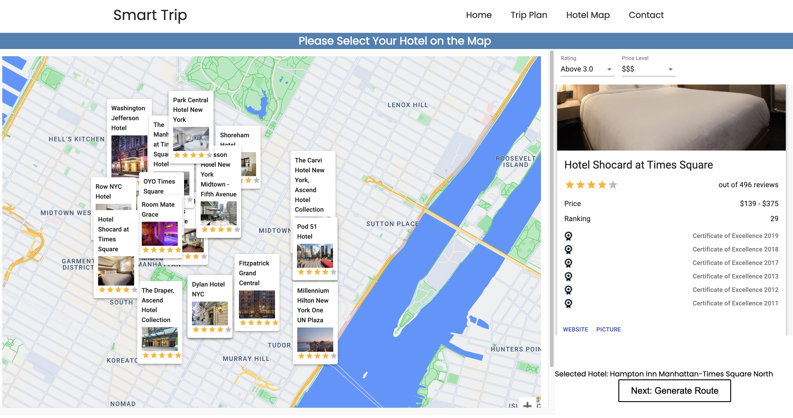
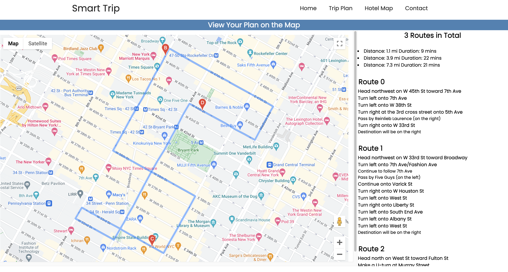

# Smart Trip: An Interative 3-in-1 Trip Planning Platform

## DESCRIPTION

SmartTrip is a comprehensive Trip Planning Website for Travelers, which combines attractionsrecommendations, Airbnb recommendations, and route planning in one, providing travelers with a moreconvenient and time-saving traveling experience.

## INSTALLATION

run command `cd smart_trip` to set your current directory to the  `smart_trip` folder. Then, run command `npm i` to install all required packages on your local machine. 

Next,run command `npm start` to open the website, the website is under the address `http://localhost:3000/`. 

## DEMO UI

